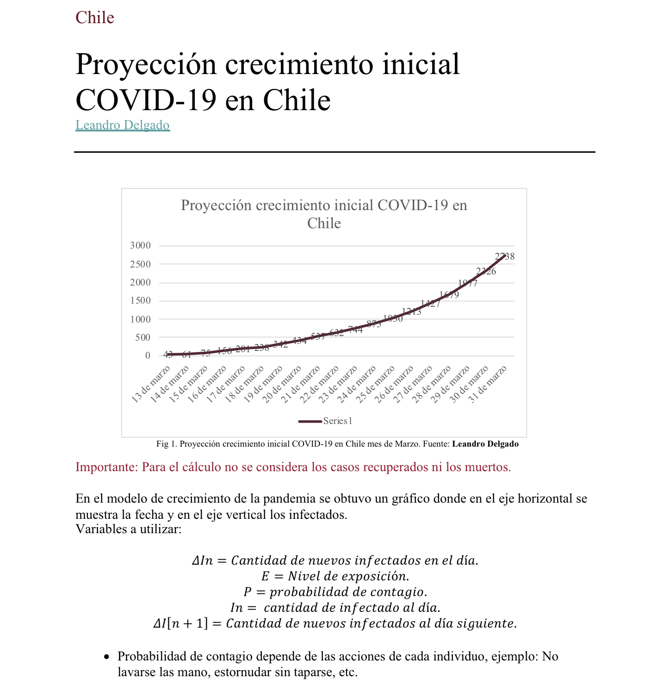
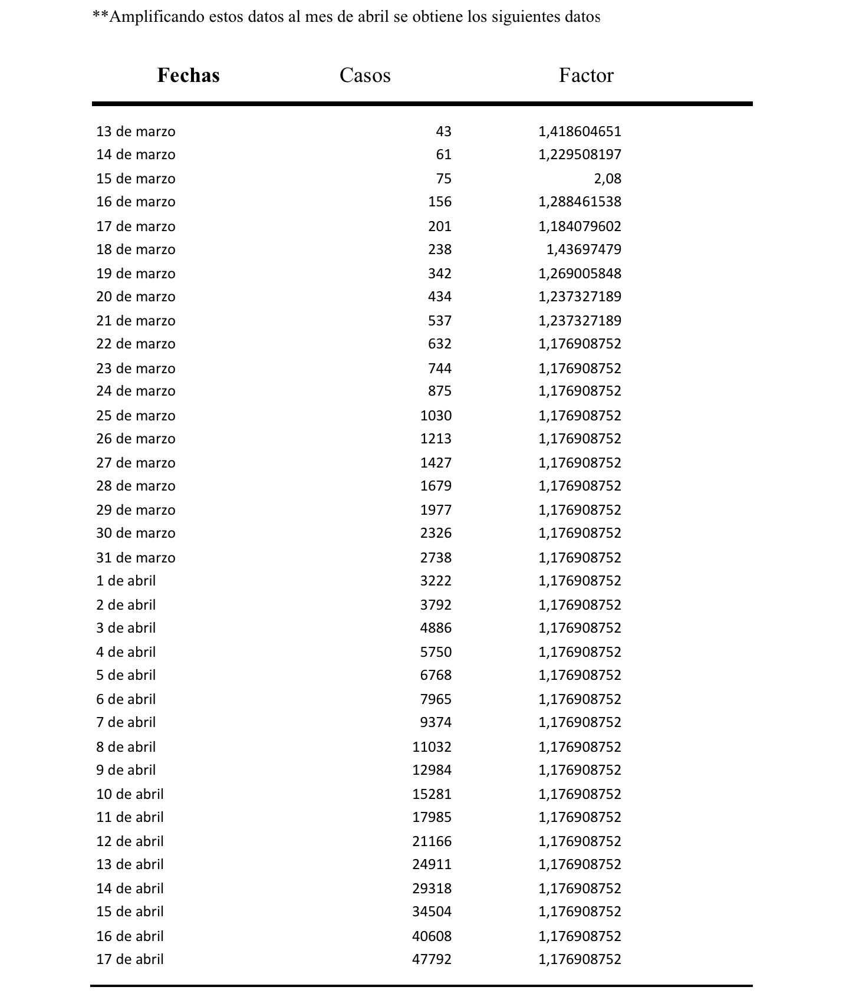
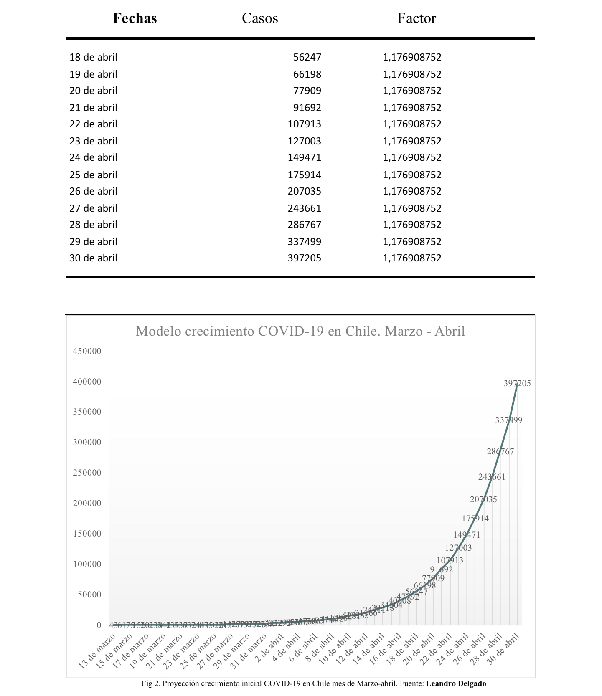

Realizado por [Leandro Delgado](https://instagram.com/leandrodelgadoa).

###### Miembro del [Centro de Nuevas Tecnologias](https://instagram.com/cnt.cl)

[Descargar investigacion ](https://github.com/l-delgado/Covid-19/blob/master/Proyecci%C3%B3n%20del%20crecimiento%20inicial%20COVID-19.docx)

###### Proyección crecimiento inicial COVID-19 en Chile Leandro Delgado Fig 1. Proyección crecimiento inicial COVID-19 en Chile mes de Marzo. Fuente: Leandro Delgado Importante: Para el cálculo no se considera los casos recuperados ni los muertos.

