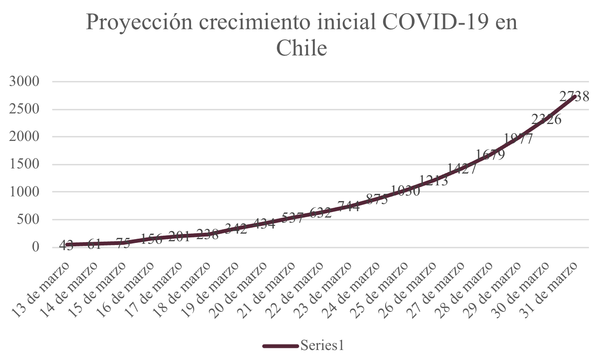

Realizado por [Leandro Delgado](https://instagram.com/leandrodelgadoa).

#### Chile

## Proyección crecimiento inicial COVID-19 en Chile



###### Fig 1. Proyección crecimiento inicial COVID-19 en Chile mes de Marzo. Fuente: Leandro Delgado

##### Importante: Para el cálculo no se considera los casos recuperados ni los muertos.

En el modelo de crecimiento de la pandemia se obtuvo un gráfico donde en el eje horizontal se muestra la fecha y en el eje vertical los infectados.
Variables a utilizar:

ΔIn=Cantidad de nuevos infectados en el día.

E=Nivel de exposición.

P=probabilidad de contagio.

In= cantidad de infectado al día.

ΔI[n+1]=Cantidad de nuevos infectados al día siguiente.

Probabilidad de contagio depende de las acciones de cada individuo, ejemplo: No lavarse las mano, estornudar sin taparse, etc.

## Modelo  
En una gráfica de infectados vs tiempo se obtiene un ΔIn (cantidad de nuevos infectados al día) donde este será directamente proporcional al nivel de exposición, probabilidad de contagia y la cantidad de contagiados al día 

##### ΔIn=E*P*In
##### Dado que ΔIn=I[n+1]-In
##### Igualando las ecuaciones se obtiene
##### I[n+1]-In=E*P*In
##### I[n+1]=E*P*In+In
##### I[n+1]=In(E*P+1)

Se logra obtener un factor F=E*P+1 

Reemplazando

##### I[n+1]=In*F
##### F=I[n+1]/In

Este factor F será el que utilizaré para poder predecir los eventos siguientes, si F es más cercano a 1 significa que la pandemia está estabilizada y no hay nuevos contagios, si F es mayor a 1 significa en términos simples que la pandemia irá creciendo mucho más. Por lo que se utiliza el Factor más cercano a 1 para medir las proyecciones, se obtiene el mejor de los casos constante.

Datos utilizados para realizar la gráfica


You can use the [editor on GitHub](https://github.com/l-delgado/Covid-19/edit/master/README.md) to maintain and preview the content for your website in Markdown files.

Whenever you commit to this repository, GitHub Pages will run [Jekyll](https://jekyllrb.com/) to rebuild the pages in your site, from the content in your Markdown files.

### Markdown

Markdown is a lightweight and easy-to-use syntax for styling your writing. It includes conventions for

```markdown
Syntax highlighted code block

# Header 1
## Header 2
### Header 3

- Bulleted
- List

1. Numbered
2. List

**Bold** and _Italic_ and `Code` text

[Link](url) and 
```

For more details see [GitHub Flavored Markdown](https://guides.github.com/features/mastering-markdown/).

### Jekyll Themes

Your Pages site will use the layout and styles from the Jekyll theme you have selected in your [repository settings](https://github.com/l-delgado/Covid-19/settings). The name of this theme is saved in the Jekyll `_config.yml` configuration file.

### Support or Contact

Having trouble with Pages? Check out our [documentation](https://help.github.com/categories/github-pages-basics/) or [contact support](https://github.com/contact) and we’ll help you sort it out.
